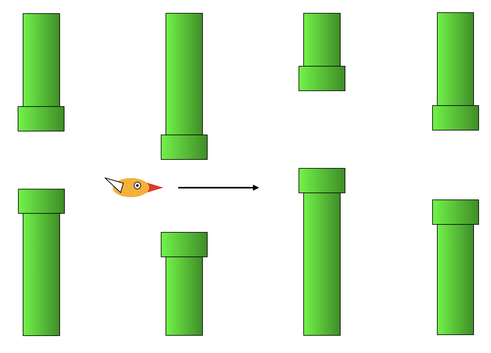
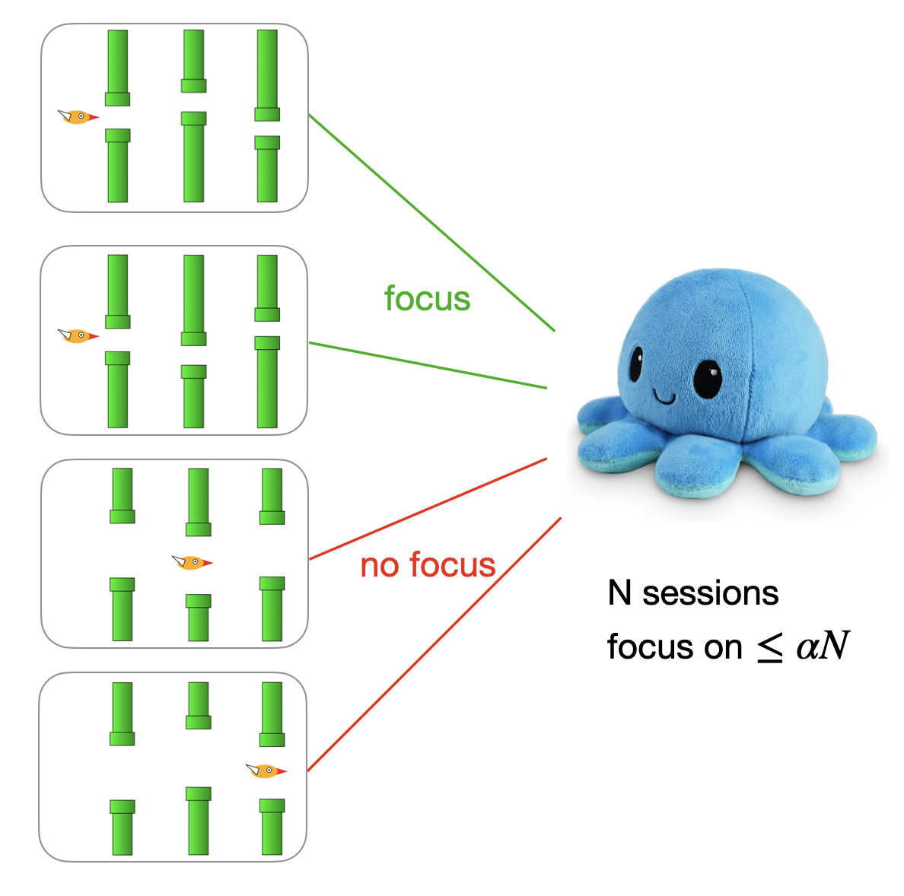
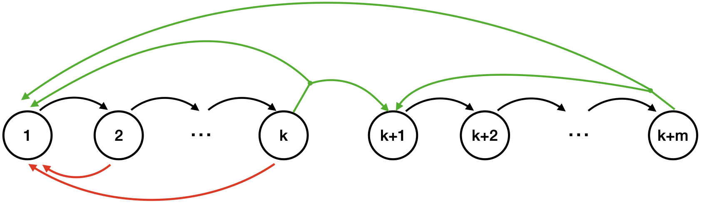
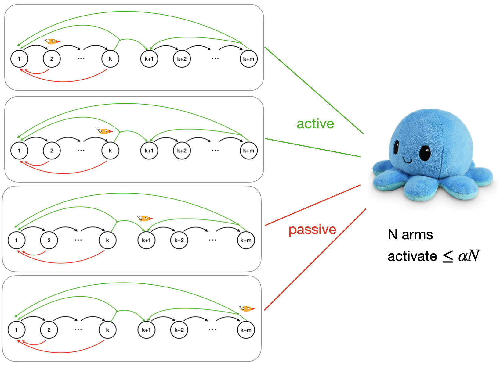
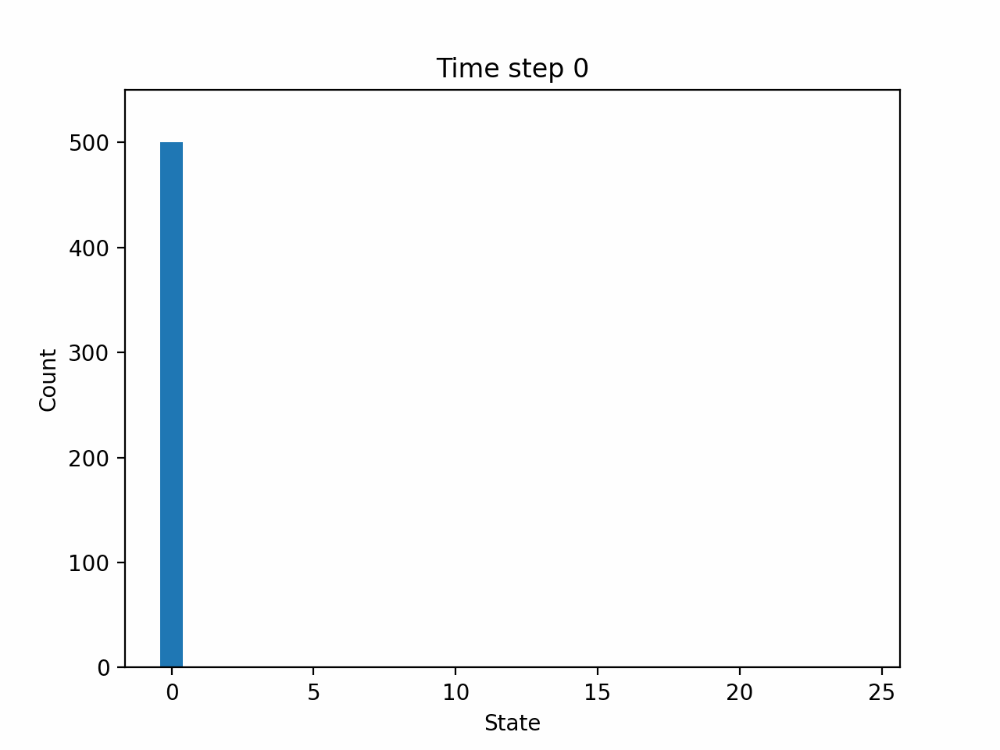
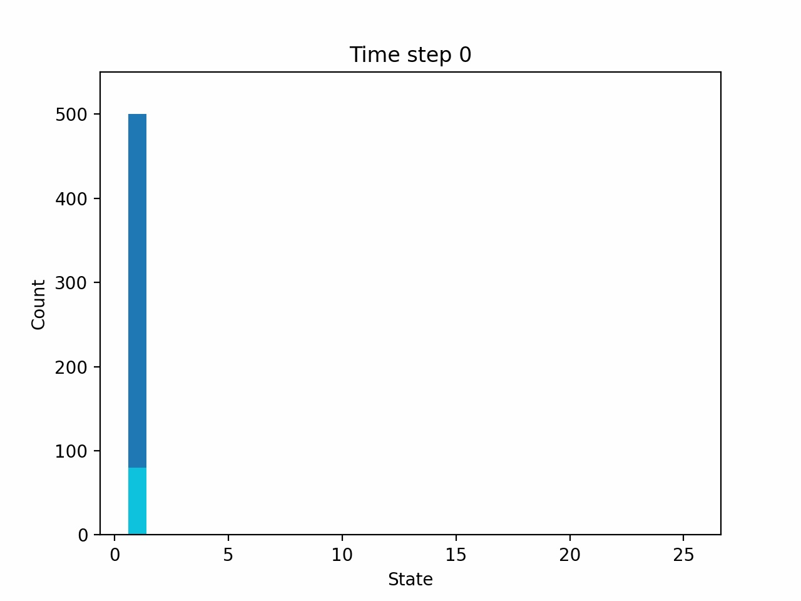
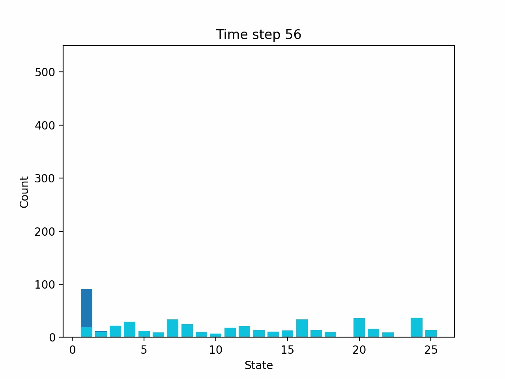
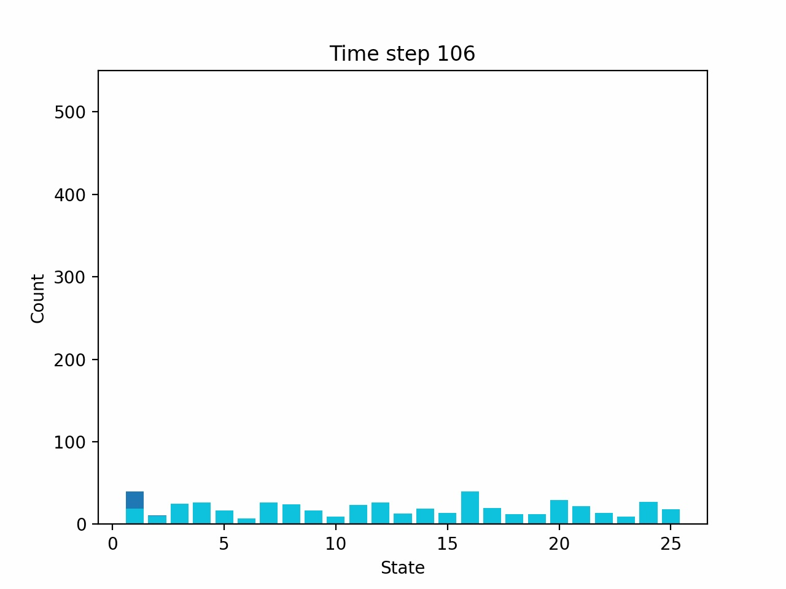
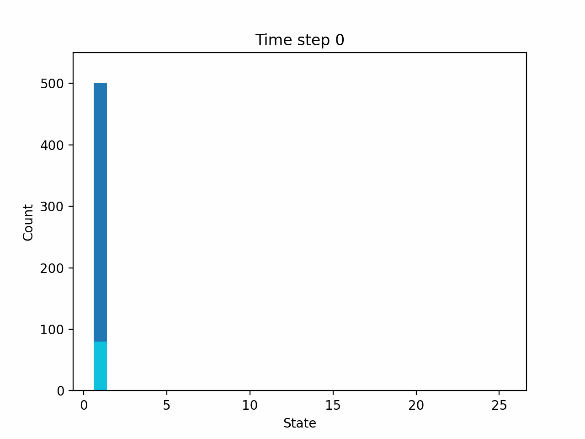

+++
# The title of your blogpost. No sub-titles are allowed, nor are line-breaks.
title = "Restless bandits"
# Date must be written in YYYY-MM-DD format. This should be updated right before the final PR is made.
date = 2025-04-29

[taxonomies]
# Keep any areas that apply, removing ones that don't. Do not add new areas!
areas = ["Theory"]
# Tags can be set to a collection of a few keywords specific to your blogpost.
# Consider these similar to keywords specified for a research paper.
tags = ["restless bandits", "long-run average reward", "asymptotic optimality"]

[extra]
author = {name = "Yige Hong", url = "https://www.cs.cmu.edu/~yigeh/" }
# The committee specification is  a list of objects similar to the author.
committee = [
    {name = "Richard Peng", url = "https://www.cs.cmu.edu/~yangp/"},
    {name = "Gauri Joshi", url = "https://www.andrew.cmu.edu/user/gaurij/"},
    {name = "Mingkuang Xu", url = "https://mingkuan.taichi.graphics/"}
]
+++

Restless bandit problem is a stochastic decision problem where the decision maker dynamically allocates resources among a set of "arms" to maximize the reward in the long term.  
It is a suitable model for many "weakly-coupled" decision problems, with applications ranging from scheduling, communication, online advertising, machine maintenance, etc. 
Despite its importance, the restless bandit problem is notoriously hard in theory --- even an approximate notion of optimality can only be achieved under restrictive assumptions. 

In this blog, we informally introduce some recent progress that relaxes the conditions for achieving _asymptotic optimality_ in restless bandits, based on our paper _[Unichain and aperiodicity are sufficient for asymptotic optimality of average-reward restless bandits](https://arxiv.org/abs/2402.05689)_. 
We will also briefly mention a generalization of the result to heterogeneous arms, multi-action and general cost functions, covered in the followup paper _[Projection-based Lyapunov method for fully heterogeneous weakly-coupled MDPs](https://www.arxiv.org/abs/2502.06072)_. 

The blog will be organized as follows: we first set up a simple example to introduce the problem and provide intuitions for our control policy. Then we provide the pseudo-code of the policy, state the theorem, and provide a proof sketch. Finally, we will briefly discuss the generalization of our result. 


<!-- 
# Overview
Dynamic decision probelm called restless bandits, which is, roughly speaking, controlling a large number of Markov Decision Processes under resource constraints

This is a classic **theoretical** problem with a long history and wide applications (list a few) (cite papers). 
Optimality is in general intractable, the goal is ``asymptotic optimality''. Still need restrictive conditions. 

We will introduce a policy called "ID policy" that is asymptotically optimal under a very weak condition. 

We first introduce RB via a made-up example. Then build towards our policy. Then a present a theoretical result and informal proof sketch. 

Finally, a bit of generalizations -->


# Motivating problem: Flappy Bird with an octopus player
Flappy Bird is an arcade-stype mobile game that once gots viral at around 2014.
In this game, the player controls a bird to fly through a forest of pipes, trying to avoid the pipes; the goal is to pass as many pipes as possible before hitting a pipe. 
Despite simple, Flappy Bird is a surprisingly hard game for humans. Even for dexterous players, it requires lots of attention and effort; for beginners, they may survive for a while when the spaces between pipes are wide, otherwise it is all about luck. 

<figure id="fig:flappy" style="text-align: center;">

 <figcaption style="margin-top: 0.5em;"> <b>Figure 1</b>: Flappy Bird </figcaption>
</figure>

A smart octopus named Sakiko tries to simultaneously play multiple sessions of this annoying game to demonstrate its superiority to humans. 
Here is what Sakiko can do:
- Sakiko has $N$ arms and can play Flappy Bird on $N$ devices simultaneously.
- At any moment, Sakiko can choose to focus on any $\alpha N$ arms for some fixed $0 < \alpha < 1$ such that $\alpha N$ is integer. 
    - The focused arms operate at a high precision and never make mistakes. 
    - The rest of the arms operate at a lower precision. These arms could make mistakes with probability $p$ when the vertical spaces between pipes are narrow, for some fixed $0 < p < 1$; these arms do not make mistakes when the spaces are wide. 

<figure id="fig:sakiko" style="text-align: center;">
 
 <figcaption style="margin-top: 0.5em;"> <b>Figure 2</b>: A Selfie of Sakiko </figcaption>
</figure>

Now consider a version of Flappy Bird that consists of _episodes_, each with multiple pipes. 
There two types of episodes: hard (with narrow spaces) or easy (with wide spaces). 
When the bird reaches the end of an episode, the game transitions to a random type of episodes with equal probabilities, and generates $1$ unit of score.
When the bird hits a pipe, the game restarts from a hard episode. 

Sakiko's goal is to play $N$ sessions of Flappy Bird simultaneously and maximize the the long-run average score achieved per unit of time by choosing the right subset of sessions to focus on. 

We call this problem the Flappy-Bird-Octopus problem, as illustrated in <a href='#fig:flappy-octopus'>Figure 3</a>. The rules are summarized as follows:
- The problem operates in discrete time, with time steps indexed by $t=0,1,2,\dots$
- In each of the $N$ sessions and at each time step, the bird attempts to pass one pipe, and Sakiko needs to decide whether to focus on this session.
    - If Sakiko focuses on this session, the bird will pass the pipe with probability $1$. 
    - If Sakiko does not focus on this session,
        - If this session is easy, the bird will still pass the pipe with probability $1$. 
        - If this session is hard, the bird will still pass the pipe with probability $1-p$ and hit the pipe otherwise. 
    - After passing a pipe,
        - the bird moves to the next pipe within this episode, or
        - if this is the last pipe in this episode, the bird moves to the first pipe in a random type of episode, and $1$ unit of score is generated.
    - After hitting a pipe,
        - the bird restarts from the first pipe in a hard episode with no score.


<figure id="fig:flappy-octopus" style="text-align: center;">

    <figcaption style="margin-top: 0.5em;"> <b>Figure 3</b>: Illustration of the Flappy-Bird-Octopus problem. 
</figcaption>
</figure>


Naively, Sakiko could certainly focus on a fixed $\alpha N$ sessions, but since not all episodes are hard, a smarter strategy is to dynamically decide which session to focus on, based on the session's current episode type and the progress within the episode. 


# Model: Restless bandits

Each session of Flappy Bird can be modeled as a _Markov Decision Process (MDP)_, 
which has a _state_ (the episode type and pipe index) that changes over time;
the decision maker takes an _action_ (to focus or not focus) every time step, which will affect the _state transition probabilities_ and the _reward_ (score). The goal is to take a proper action based on the state, to maximize the average reward over the long run. 

Formally, an MDP is defined by a tuple $(\mathbb{S}, \mathbb{A}, P, r)$:
- **State space** $\mathbb{S}$. For Flappy Bird, $\mathbb{S} = \{1, 2, \ldots, k, k+1, \ldots, k+m\}$, where states $1$ to $k$ correspond to pipes in a hard episode and states $k+1$ to $k+m$ correspond to pipes in an easy episode.
- **Action space** $\mathbb{A}$. For Flappy Bird, $\mathbb{A} = \{0, 1\}$, where action $1$ means to focus (high precision) and action $0$ means to not focus (low precision).
- **Transition probability kernel** $P(s' \mid s, a)$ for $s,s'\in\mathbb{S}$ and $a\in\mathbb{A}$. $P(s' \mid s, a)$ denotes the probability of transitioning to state $s'$ in the next time step when taking action $a$ at state $s$. For Flappy Bird, the transition probabilities is illustrated in <a href='#fig:mdp'>Figure 4</a>.
- **Reward function** $r(s, a)$ for $s\in\mathbb{S}$ and $a\in\mathbb{A}$, denoting the immediate reward when taking action $a$ at state $s$. For Flappy Bird, $r(k, 1) = 1$, $r(k+m, 1) = r(k+m,0) = 1$, and $r(s,a) = 0$ for other $(s,a)$-pairs. 

A _policy_ $\bar{\pi} = (\bar{\pi}(a|s))_{s\in\mathbb{S},a\in\mathbb{A}}$ is a conditional distribution of the actions given states. The _long-run average reward_ under policy $\bar{\pi}$ is defined as:
$$
R_1^{\bar{\pi}} = \lim_{T \to \infty} \frac{1}{T} \sum_{t=0}^{T-1} \mathbb{E}\left[ r(S_t, A_t) \right],
$$
where $S_t$ is the state at time $t$ and $A_t$ is the action at time $t$; the expectation is taken over the randomness of state transitions and action sampling. 


<figure id="fig:mdp" style="text-align: center;">

    <figcaption style="margin-top: 0.5em;"> <b>Figure 4</b>: Illustration of the MDP.  Cycles denote the states, and arrows denote possible transitions. A black arrow corresponds to a success event (passing a pipe) within an epside, which triggers a transition to the next state (next pipe within the episode).
    A green arrow corresponds to a success event at the end of an episode, which generates 1 unit of reward and triggeres a transition to state 1 (the first pipe in a hard episode) or state k+1 (the first pipe in an easy episode) with equal probability. A red arrow corresponds to a failure event (hitting a pipe), which causes a transition to state 1. A failure event happens with probability p when the arm is in states 1,2, ..., k and is not activated. 
</figcaption>
</figure>

The sequential decision problem that Sakiko faces is the so-called _restless bandits_, which involves controlling multiple MDPs simultaneously with a joint _budget constraint_ on the actions (to only focus on no more than $\alpha N$ sessions). 
Each MDP is also called an _arm_ (here: a Flappy Bird session/device); each arm admits two actions, conventionally called active and passive -- in this application “active” means focusing on the session (high-precision play) and “passive” means not focusing (low-precision play). 
The control rule of restless bandits is again described by a policy $\pi$, but now it is a conditional probability of the actions of all arms (elements in $\mathbb{A}^N$), given their states (elements in $\mathbb{S}^N$). 
The goal of restless bandit is to find a policy $\pi$ that maximizes the long-run average reward per arm and per unit time, subject to the budget constraint, i.e.,
<span id="eq:N-arm-problem"></span>
$$
\begin{aligned}
\text{maximize}_{\pi} \quad &R_N^\pi \triangleq  \lim_{T \to \infty} \frac{1}{TN}\sum_{t=0}^{T-1} \sum_{i=1}^N \mathbb{E}\left[ r(S_t(i), A_t(i)) \right],\\
\text{subject to } & \sum_{i=1}^N  A_t(i) \leq \alpha N \quad \forall t=0,1,2,\dots
\end{aligned} \tag{1}
$$
where $S_t(i)$ is the state of arm $i$ at time $t$ and $A_t(i)$ is the action of arm $i$ at time $t$; the expectation is taken over the randomness of state transitions and action sampling. 


<figure id="fig:rb" style="text-align: center;">

    <figcaption style="margin-top: 0.5em;"> <b>Figure 5</b>: Illustration of the restless bandit problem. 
</figcaption>
</figure>


Restless bandits were introduced in Peter Whittle’s [seminal paper](https://www.cambridge.org/core/journals/journal-of-applied-probability/article/abs/restless-bandits-activity-allocation-in-a-changing-world/DDEB5E22AFFEFF50AA97ADC96B71AE35) in 1988. “Restless” refers to the fact that every arm keeps evolving over time whether it is being acted on or not (in contrast to “rested” bandits, where inactive arms freeze). 
The restless bandit problem could be used to model a wide range of real-life problems. 
For instance, in the same spirit as the Flappy-bird-octopus problem, restless bandits could model the management of multiple ongoing projects with two groups of staffs, one group of staffs is more dexterous by have limited availabilities, whereas the other group is more available but is less effective. 
Other applications involve job scheduling, machine maintenance, wireless communication, content moderation, etc. 

The restless bandit problem is fundamentally difficult: the whole problem is a MDP whose state space is the Cartesian product of all component state spaces, which grows exponentially with the number of arms. There are other formal hardness results for finding the exact optimal solution of restless bandits. 

Because of the hardness, we aim for asymptotic guarantees rather than exact solutions. Concretely, a policy $\pi$ is called *asymptotically optimal* if the per-arm, long-run average reward gap vanishes as the number of arms N grows:
$$
    \lim_{N\to\infty} \bigl(R_N^* - R_N^\pi\bigr) = 0,
$$
where $R_N^* \triangleq \sup_{\pi} R_N^\pi$ denotes the optimal long-run average reward.


<!-- Stick to "session" or "MDP" to refer to "arm / bandit" -->


<!-- # Model


### Each session as a Markov Decision Process (MDP)

(An important possible confusion: each state is a pipe, or an episode? There are two episodes? infinitely many episode? Maybe use colors on the states to clarify, or explicitly draw the mapping... )

We consider the games as changing at discrete times. 
Each game has a state, i.e., which episodes the bird is in and how long long until the episode ends. 
Based on the state of the game, Sakiko can choose to interfere, or not interfere --- which means let a bot operate for this time step. 
The decisions leads to differet immediate and future consequences. 

To analyze in detail the consequence of different decisions, 
we model each game as a Markov Markov Decision Process (MDP). 
An MDP is defined by four elements: _state space_, _action space_, _transition probabilities_, and _reward function_. In this example, 
- State space $\mathbb{S} = \{1,2,\dots k, k+1, \dots k+m\}$, where the first $k$ states correspond to pipes in a difficult episode, and the last $m$ states correspond to pipes in an easy episode. 
- Action space $\mathbb{A} =\{0,1\}$, where action $1$ means to interfere, and action $0$ means to not interfere. 
- The state transitions randomly, and the distribution of the next state depends on the current state and action. 
- The reward is also a function of the current state and action. 


Decription of state transition (illustrated by [Figure 3](#fig:mdp)):
- Each time, success or fail. The success prob. depends on whether it is a hard or easy episode ($s\leq k$ or $s > k$) and whether Sakiko interferes. 
- If success in the middle of an episode, move forward. 
- If success in the at the end of an episode, jump to state $1$ (the beginning of the difficult episode) or the state $k+1$ (the beginning of the easy episode) with equal probabilities, and get $1$ unit of reward; if fail start over from state $1$ (in a difficult episode). 


<figure id="fig:mdp" style="text-align: center;">

    <figcaption style="margin-top: 0.5em;"> <b>Figure 3</b>: Illustration of the MDP.  Cycles denote the states, and arrows denote possible transitions. A black arrow corresponds to a success event within an epside, a green arrow corresponds to a success event at the end of an episode, and a red arrow corresponds to a failure event. 
</figcaption>
</figure>

More precisely, the transition probabilities and the reward function can be represented in the form of the transition kernel $(P(s,a,s'))_{s,s'\in\mathbb{S}, a\in\mathbb{A}}$ and reward function $(r(s,a))_{s\in\mathbb{S},a\in\mathbb{A}}$, 
where $P(s,a,s')$ denotes the probability of going to state $s'$ in the next time step, when takes action $a$ at state $s$, and $r(s,a)$ denotes the reward of taking action $a$ at state $s$. 
Here we omit writing them out the transition in full for concreteness; instead, we specify them in the pseudo-code. 
```python
import numpy as np

def get_next_state_and_reward(s,a):
    # If in an easy episode or being interfered
    if (s >= k+1) or (a == 1):
        p_succ = 1
    # If in a hard episode or being interfered
    else:
        p_succ = 0.1
    p_fail = 1 - p_succ

    if (s < k) or (k+1 <= s < k+m): 
        # in the middle of an episode
        success = np.random.binomial(n=1, p=p_succ)
        next_state = s+1 if success else 1
        reward = 0
    else: 
        # at the end of an episode
        go_to_1 = np.random.binomial(n=1, p=p)
        next_state = 1 if go_to_1 else k+1
        reward = p_succ
    return next_state, reward
``` -->


# Construction of the asymptotically optimal policy

**Q**: How should we efficienty find an asymptotically optimal policy for restless bandits? 

As mentioned in the last section, the state space of the problem grows exponentially with the number of arms, $N$. So we definitely do not want to start with a fully general policy class that makes decision based on the full state representation of the system $(S_t(i))_{i=1}^N$. It is more useful to brainstorm for some heuristics. 

**Q**: If we ignore the constraint and focus on a single arm, can we find a single-armed policy $\bar{\pi}$ to optimize the long-run average reward of this arm?

**A**: Yes. Each arm is just an MDP, so any standard techniques could apply, such as vallue iteration, policy iteration, or linear programing (see, e.g., such as Chapter 8 of [Puterman'94](https://onlinelibrary.wiley.com/doi/book/10.1002/9780470316887)). 

Specializing to the example of Flappy Bird, the policy that optimizes the long-run average-reward of a single arm should be obvious: any policy $\bar{\pi}$ that chooses the "focus" action on all states in $1,2,3,..k$ (pipes in hard episode), i.e., 
$$
\bar{\pi}(1\,|\, s) = 1 \quad \text{for} \quad s\in\{1,2,\dots, k\}
$$ (\#eq:single-arm-constraint-free)
achieves the optimal long-run average reward, which is $2/(k+m)$. 
Intuitively, by choosing the "focus" action on all states in $1,2,3,..k$, the Flappy Bird keeps passing all pipes with probability $1$, and thus score in the fastest possible way. 

However, the above condition does not exclude some "wasteful" policies --- a naive one would simply choose to focus in all states. 
A wasteful policy is not useful for guiding the control of the $N$-armed restless-bandit problem, which has a budget constraint of focusing on $\leq \alpha N$ arms every time step.

**Q**: How to define a more "budget-efficient" single-armed policy that maximizes the reward?

**A**: Consider the following *single-armed problem under budget constraint*: <span id="eq:single-arm-problem-with-constraint"></span>
$$
\begin{aligned}
\text{maximize}_{\bar{\pi}} \quad &R_1^{\bar{\pi}} \triangleq \lim_{T \to \infty} \frac{1}{T} \sum_{t=0}^{T-1}  \mathbb{E}\left[r(S_t, A_t) \right] \\
\text{subject to } &\lim_{T \to \infty} \frac{1}{T} \sum_{t=0}^{T-1} \mathbb{E}\left[ A_t\right]  \leq \alpha.
\end{aligned} \tag{2}
$$
This problem imposes an additional budget constraint, requiring this arm to be active for no more than $\alpha$ fraction of the time in the long run. 
This budget constraint is a relaxed version of the every-time-step constraint in restelss bandits. 
By adding this relaxed constraint, we hope to make this sub-problem closer to the original problem, while still being easy to solve. 

For the Flappy Bird example, suppose $\alpha = k/(k+m)$, it is not hard to see that the optimal solution $\bar{\pi}^*$ is given by 
<span id="eq:single-arm-with-constraint"></span>
$$
\bar{\pi}^*(1\,|\, s) = 
\begin{cases}
1 \quad &\text{for} \quad s\in\{1,2,\dots, k\} \quad\\
0 \quad &\text{for} \quad s\notin\{1,2,\dots, k\}.
\end{cases} \tag{3}
$$
Intuitively, this policy chooses to focus only when necessary, i.e., when in a hard episode. 

For other $\alpha$ or more general problems, the single-armed problem under budget constraint should be treated as a _contrained MDP_, and there are many existing algorithm in the literature for solving it. One particular way is through linear programming, and we refer the readers to Section 3.3 of [our paper](https://arxiv.org/abs/2402.05689) for details. 


**Q**: How does $\bar{\pi}^*$ help us design policies for the restless bandit problem?

**A**: First, notice that
<span id="eq:upper-bound"></span>
$$
    R_1^{\bar{\pi}^*} \geq R_N^*. \tag{4}
$$
<!-- The per-time-step constraint in [Equation (1)](#eq:N-arm-problem) is more stringent than the long-run average constraint in [Equation (2)](#eq:single-arm-problem-with-constraint), so any feasible policy $\pi$ of [Equation (1)](#eq:N-arm-problem) can be emulated by a feasible policy $\bar{\pi}$ of [Equation (2)](#eq:single-arm-problem-with-constraint) -->
This is because the every-time-step budget constraint in [(1)](#eq:N-arm-problem) is more stringent than the long-run average budget constraint in [(2)](#eq:single-arm-problem-with-constraint). 
Intuitively, under any feasible policy $\pi$ of [(1)](#eq:N-arm-problem), a random arm of restless bandits must satisfy the long-run average constraint of [(2)](#eq:single-arm-problem-with-constraint), and can thus be emulated by a feasible policy of [(2)](#eq:single-arm-problem-with-constraint). Therefore, the optimal reward of [(1)](#eq:N-arm-problem), $R_N^*$, should be no more than the optimal reward of [(2)](#eq:single-arm-problem-with-constraint), $R_1^{\bar{\pi}^*}$. 

<!-- In light of [(4)](#eq:upper-bound), consider the idealized but infeasible policy $\pi'$ that samples actions for each arm $i$ using the distribution $\bar{\pi}^*(\cdot|S_t(i))$. Under $\pi'$,  the long-run average reward $R_N^{\pi'}$ meets the upper bound $R_1^{\bar{\pi}^*}$. However,  -->

In light of [(4)](#eq:upper-bound), a policy $\pi$ would be optimal if it were able to sample the action for each arm $i$ from the distribution $\bar{\pi}^*(\cdot|S_t(i))$ for every time step $t$, as this would imply $R_N^\pi = R_1^{\bar{\pi}^*} \geq R_N^*$. In other words, $\bar{\pi}^*$ defines the idealized action distributions that each arm wants to follow. 

While exactly following $\bar{\pi}^*$ is often impossible due to the stricter the budget constraint of [(1)](#eq:N-arm-problem), we could still try to let as many arms as possible follow $\bar{\pi}^*$. Specifically, consider the following class of policies:

**$\bar{\pi}^*$-guided policy**: For each time step $t = 0, 1, 2, \ldots$:

1. **Sample ideal actions** for each arm $i \in \{1, 2, \ldots, N\}$ independently:
    $$A_t^{\text{ideal}}(i) \sim \bar{\pi}^*(\cdot \mid S_t(i))$$

2. **Count arms wanting to be active**:
    Let $$\mathcal{I}_t = \{i : A_t^{\text{ideal}}(i) = 1\}$$

3. **Enforce budget constraint**:
    - If $|\mathcal{I}_t| \leq \alpha N$: set $A_t(i) = A_t^{\text{ideal}}(i)$ for all $i$
    - If $|\mathcal{I}_t| > \alpha N$: Select a subset $\mathcal{J}_t \subseteq \mathcal{I}_t$ with $|\mathcal{J}_t| = \alpha N$ using a certain _tie-breaking rule_. Set $A_t(i) = 1$ if $i \in \mathcal{J}_t$ and $A_t(i) = 0$ otherwise.

4. **Execute actions** and observe state transitions for each arm.

Different tie-breaking rules yield different policies and may lead to different performances. The hope is that with a proper tie-breaking rule, in the steady state, all but an $o(1)$ fraction of arms follow $\bar{\pi}^*$, which would imply 
$$
R_N^\pi \geq R_1^{\bar{\pi}^*} - o(1) \geq R_N^* - o(1),
$$ 
so $\pi$ would be asymptotically optimal.

Specializing to the Flappy Bird example, an instance of $\bar{\pi}^*$-guided policy focuses on as many arms in the states $\{1,2,3,\dots, k\}$ (i.e., in hard episodes) as poissble, and use a tie-breaking rule when there are more than $\alpha N$ such arms. 

Next, we will discuss what should be the right tie-breaking rule for restless bandits. 
When mentioning the Flappy Bird example, we let the number of  states in a hard episode $k=4$, number of states in an easy episode $m=21$, failure probability $p=0.9$, and $\alpha = k/(k+m) = 0.16$ for the ease of presentation. In this case, $\bar{\pi}^*(1|s) = 1$ iff $s\in\{1,2,3,4\}$ and $R_1^{\bar{\pi}^*} = 2/(k+m) = 0.08$. 


## Tie-breaking rule for $\bar{\pi}^*$-guided policy: a naive attempt


**Q**: Can we break ties uniformy at random? 

<!-- randomly select a session that requires focus (i.e., a hard episode) -->


**A**: No. As shown in <a href='#fig:random-tb'>Figure 6</a> below, most arms stuck in the state $\{1,2,3,4\}$, suggesting that the most birds keep hitting the pipes and fail to pass any episode. The average reward after simulting $10^4$ time steps is $0.0058$, which is much smaller than $R_1^{\bar{\pi}^*} = 0.08$. 

**Q**: Wny does this happen? 

**A**: When all arms are initialized in states $\{1,2,3,4\}$, they all require persistent focuses to pass the hard episode and reach the rest of the space. However, under the random tie-breaking rule, each arm is activated with probability $\alpha = 0.16$, and fails with probability $(1-\alpha)*p = 0.756$. Consequently, most arms cannot succeed $4$ times in a row and will keep falling back to state $1$. 


<figure id="fig:random-tb" style="text-align: center;">

    <figcaption style="margin-top: 0.5em;"> <b>Figure 6</b>: Random tie-breaking rule is applied to the Flappy-Bird example with N=500. The height of each bar counts the number of arms in each state. 
</figcaption>
</figure>


<!-- <div class="remark" style="background: linear-gradient(90deg,#fbfbff,#f7fcff); border-left:4px solid #4b84f0; padding:1em; border-radius:8px; box-shadow:0 6px 18px rgba(18,35,58,0.06); font-family: system-ui, -apple-system, "Segoe UI", Roboto, "Helvetica Neue", Arial, sans-serif; font-size:0.95rem; line-height:1.5; color:#111;"> -->

**Remark.** In the prior work on restless bandits, a dominant class of policies is the so-called index policies or priority policies. These policies can be roughly viewed as a $\bar{\pi}^*$-guided policy using a more sophisticated tie-breaking rule, which ranks the arms based on their states.  

The index / priority policies are proved to be asymptotically optimal under a few assumption, one of them being the so-called _global attractor property (GAP)_. GAP assumes that the state distribution of the arms converge to a $o(1)$ neighborhood of the stationary distribution of $\bar{\pi}^*$ distribution, effectively assuming away the bad situation illusrated in <a href='#fig:mdp'>Figure 6</a>. However, there exist documneted instances where GAP fails for GAP. We refer the readers to Section 2 of [our paper](https://arxiv.org/abs/2402.05689) for a review of the prior work's status. To see some concrete illustration of the simulation results on these instances, see Section 8 of [our paper](https://arxiv.org/abs/2402.05689) and Section 3.3 of [our previous paper](https://arxiv.org/abs/2306.00196). 

<!-- <p>Intuitively, the limitation stems from weak control over the population distribution: greedy state-priority rules do not ensure the persistent and targeted effort some MDPs require. Prior work regarded controlling the distribution as prohibitively complex --— our results show that persistency is the key and that distributional control is achievable under much weaker conditions than previously thought.</p> -->

<!-- <p style="font-size:0.85rem; color:#444; margin-top:0.5rem;"></p> -->
<!-- </div> -->


## Persistency and ID policy
**Q**: As discussed above, the random tie-breaking rule fails because it lacks persistency. What would be a natural tie-breaking rule that encodes the persistency?

**A**: Consider the following simple tie-breaking rule: we always prioritize arm $i$ over arm $j$ to follow $\bar{\pi}^*$ if $i < j$. We call the resulting $\bar{\pi}^*$-guided policy the _ID policy_, as it break ties using the IDs ($i$ and $j$) of the arms. 
In this way, the arms with small ID are likely to keep receiving a high priority and could follow $\bar{\pi}^*$ for a long time. 

Translating to the Flappy Bird example, the ID policy simply looks at all arms in states $1,2,3,4$ (hard episodes); the there are more than $\alpha N$ such arms, the policy focus on $\alpha N$ of them with the smallest IDs. 

**Q**: Does this work?

**A**: Yes. As illustrated in <a href='#fig:id-policy'>Figure 7</a>, the state distribution of the arms gradually converge to uniform, after which most arms are able to continuously pass the episodes without triggering much failure events. The average reward after simulting $10^4$ time steps is $0.0774$, which is close to $R_1^{\bar{\pi}^*} = 0.08$. 


<figure id="fig:id-policy" style="text-align: center;">

    <figcaption style="margin-top: 0.5em;"> <b>Figure 7</b>: ID policy is applied to the Flappy-Bird example with N=500. The height of each bar counts the number of arms in each state. 
</figcaption>
</figure>


# Optimality result

To state the results, we first define a few notation. Consider the Markov chain on the state space $\mathbb{S}$ induced by the policy $\bar{\pi}*$. 
We let $\mu^*$ be the stationary distribution of this Markov chain, and let $P^t(s,s')$ be the $t$-step transition matrix. 
We define the mixing time $\tau$ as 
$$
    \tau \triangleq \max_{s\in\mathbb{S}} \min \left\{t=0,1,2\dots \colon \sum_{s'\in\mathbb{S}} \left|P^t(s,s') - \mu^*(s') \right| \leq \frac{1}{e} \right\}.
$$
Intuitively, given any initial state $s\in\mathbb{S}$, after $\tau$ time steps, the state distribution of the Markov chain $P^t(s,\cdot)$ is sufficiently close to the stationary distribution $\mu^*(\cdot)$.  


**Theorem 1** (informal): Assume $\tau < \infty$, and let $\pi$ be the ID policy. Then 
<!-- $$
    R^{rel} - R(\pi, \bm{S}_0) \leq \frac{672\lambda_W^{5/2}|\mathbb{S}|^{3/2}}{\min(\alpha,1-\alpha)^3\sqrt{N}}.
$$ -->
$$
    R_1^{\bar{\pi}^*} - R_N^\pi = O\left(\frac{\tau^4}{\sqrt{N}}\right),
$$
where the factors hidden in the big-O notation include $|\mathbb{S}|$, $\alpha$, and $\max_{s,a} |r(s,a)|$. 


**Remark**: The mixing time $\tau$ is finite when the underlying Markov chain is aperiodic and irreducible. One can verify that this is satisfied by the Flappy Bird example. 


# Proof idea of Theorem 1
One might wonder why this simple ID-based tie-breaking works. 
As discussed in the [previous section](#construction-of-the-asymptotically-optimal-policy), this boils down to proving that after a certain period of time, all but $o(1)$ fraction of arms could follow the ideal actions sampled from $\bar{\pi}^*$. 
Here is the intuitive argument: 

1. First, since we can activate at most $\alpha N$ arms, $\alpha N$ arms with the smallest IDs always follow $\bar{\pi}^*$ under the ID policy.

2. These $\alpha N$ arms will mix to the stationary distribution $\mu^*$ after some time. After the mixing, the state of each arm is an independent sample from $\mu^*$, and requires activation with probability $\alpha$. Consequently, the budget requirement of these $\alpha N$ arms concentrate around $\alpha * \alpha N = \alpha^2 N$.
    - Specializing to the Flappy bird example, the states of the $\alpha N$ arms converge to the uniform distribution, after which only about $\alpha^2 N$ of them requires focus. 

3. Now consider the remaining $(1-\alpha)N$ arms: we can activate at about $\alpha N - \alpha^2 N = \alpha (1-\alpha) N$ of them, i.e., $\alpha$ fraction of the remaining arms. Repeating the argument in Step 2, the states of these arms will also mix to $\mu^*$ after some time. 

4. Repeating this process, the number of remaining arms not following $\mu^*$ should approximately shrink by the ratio $(1-\alpha)$ each step. In the long run, all but $o(1)$ fraction of arms could follow $\bar{\pi}^*$, where the $o(1)$ error terms comes from the randomness in the budget requirements of the arms that have mixed. 

The process described above is illustrated in <a href='#fig:proof'>Figure 8</a>: from time step $0$ to $56$ to $106$, more and more arms start to follow $\bar{\pi}^*$ (cyan parts of the bars), and their empirical state distribution approaches the uniform distribution. 


<figure id="fig:proof" style="text-align: center;">




    <figcaption style="margin-top: 0.5em;"> <b>Figure 8</b>: The dynamics of ID policy when applied to the Flappy Bird example. The cyan part of the bar represents the number of arms following the ideal actions. 
</figcaption>
</figure>


This multi-phase argument covers most intuitions of the proof, except that in reality, the mixing of the individual arms under $\bar{\pi}^*$ and the expansion of the set of arms following $\bar{\pi}^*$ happen simultaneously and continuously. 
To make an analogy, imagine a **glacier melting from the bottom and gradually reducing to the sea level**; the part of glacier that begins to melt correspond to the arms that starts to follow $\bar{\pi}^*$, whereas the part already melt correspond to arms that have mixed to the the uniform distribution. 
To formally track these two simultaneous changes and account for the occasional stochasticity that disrupt the convergence, we invent a technique called **bivariate Lyapunov function**. We leave the readers to Section 5 of [our paper](https://arxiv.org/abs/2402.05689) for the details of this technique. 


<!-- Try to intuitively explain the 4-th order dependency on $\tau$ -->

# Generalizations
The techniques outlined in this paper could generalize beyond the restless bandit setting in multiple ways:
- We could allow multiple actions per arm. For the Flappy Bird example, this could mean having multiple levels of focus, each with a different success rate, and the total amount of focus that Sakiko could spend at a moment is subject to an upper limit. 
    - We could even have a more refined model to control the Sakiko's specific movement when playing the game, such as tapping the phone screen at a certain rate and pressure; different movement could have require a different amount of effort, and the total effort at a moment should bounded by a fixed amount.
- We could also have multiple constraints. For the Flappy Bird example, this could mean each action is associated with two different types of costs, such as mental effort and physical effort; the total mental and physical efforts are subject to two separate constraints.
- We could also allow the arms to be heterogeneous, i.e., having different reward function, transition dynamics, and cost functions for different arms. For the Flappy Bird example, different parallel sessions could have a different success rates under the same actions.

The multi-action, multi-constraint generalization of restless bandits is called weakly-coupled Markov Decision Processes (WCMDPs). The policy design for WCMDPs follows a similar idea: first consider a relaxation that decouples the controls of $N$ arms into separate single-armed problems; then, convert the single-armed solution back to an $N$-armed policy using ID-based prioritization. 
The asymptotically optimality of the resulting can be proved almost proved verbatim, as the primary argument we use is just the mixing of the Markov chains.

With heterogeneity, the solution is more complex: for policy design, we need to uniformly shuffle the arms at time $0$ before applying ID policy, in case the low-ID arms happen to be resource hungry, causing the high-ID arms to starve. 
The analysis is complicated by the fact that the state-distribution diagrams we draw from Figures 6~8 no longer fully capture the system state, given the heterogeneity. We refer the readers to our second paper [Projection-based Lyapunov method for fully heterogeneous weakly-coupled MDPs](https://www.arxiv.org/abs/2502.06072) for more details.

<!-- For all these generalization, the core idea of our policy design is the same: first consider a relaxation that decouples the controls of $N$ arms into separate single-armed problems; second, convert the single-armed solution back to an $N$-armed policy using ID-based prioritization. The analysis will also be similar, except that the heterogeneity brings an additional layer of complexity of representing the state space. We refer the readers to our second paper [Projection-based Lyapunov method for fully heterogeneous weakly-coupled MDPs](https://www.arxiv.org/abs/2502.06072) for more details.  -->
